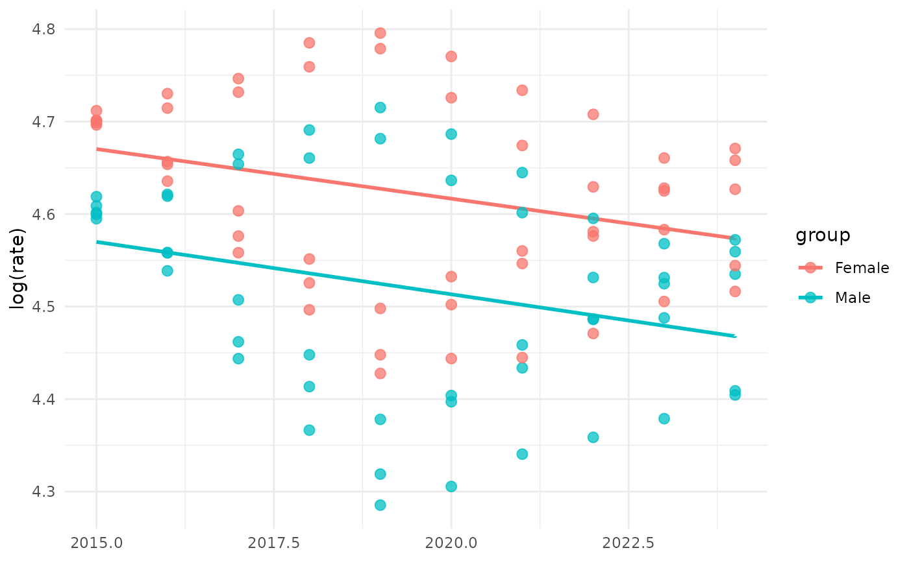
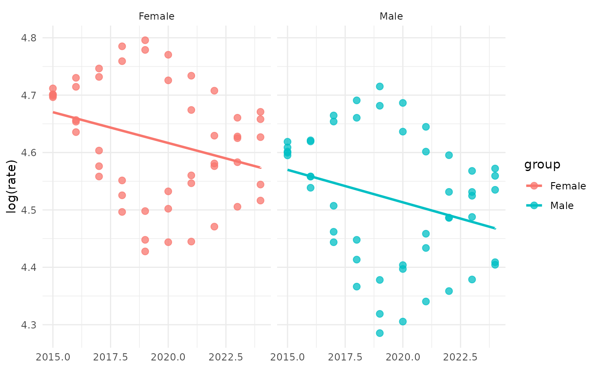
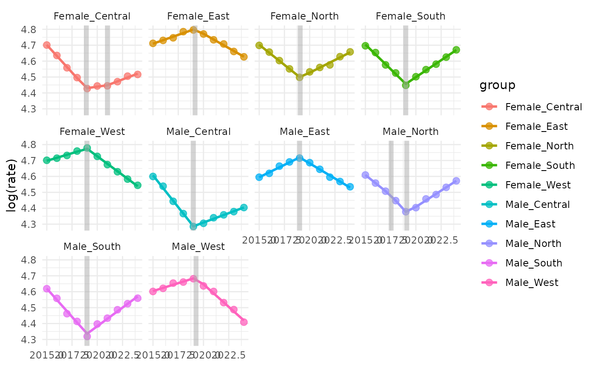
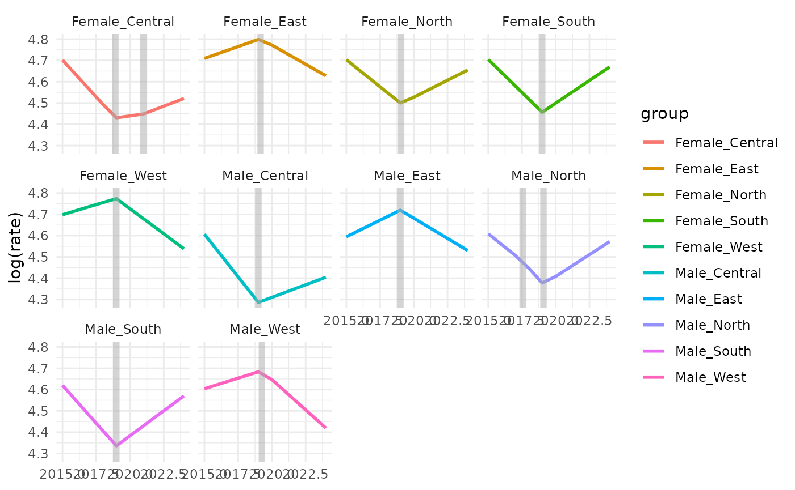
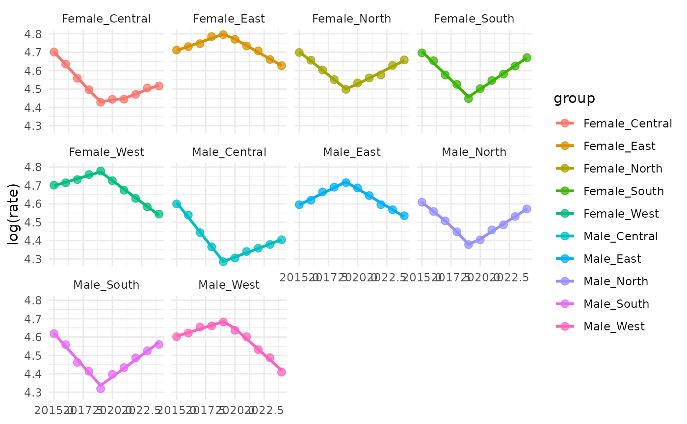
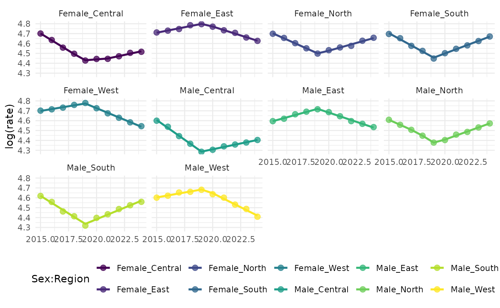
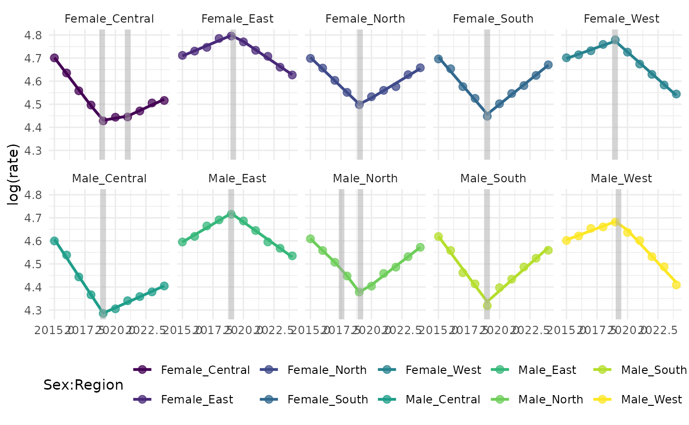

# Introduction to JoinpointR

Joinpoint regression is commonly used in epidemiology to identify
changes in temporal trends. The joinpointR package provides tools to fit
joinpoint regression models, estimate annual percentage changes, and
present results.

## Joinpoint regression models by group

The function [`model_jp()`](../reference/model_jp.md)allows to fit
joinpoint regression models with a log-response by levels of one or more
categorical variable(s). For the examples, we are going to use a
simulated dataset with the HIV rates by sex in five regions

``` r

# id: example-data
# Load required packages
library(dplyr)
library(tidyr)
library(ggplot2)
library(joinpointR)

# Seed for reproducibility
set.seed(123)

# Generate example data
data <- expand_grid(
  year = 2015:2024,
  sex = c("Male", "Female"),
  region = c("North", "Central", "South", "East", "West")
) %>%

  left_join(
    tribble(
      ~region   , ~slope1 , ~slope2 ,
      "North"   ,      -6 ,       4 ,
      "Central" ,      -5 ,       3 ,
      "South"   ,       3 ,      -4 ,
      "East"    ,      -7 ,       2 ,
      "West"    ,       2 ,      -5
    )
  ) %>%

  mutate(
    trend = if_else(
      year <= 2019,
      slope1 * (year - 2015),
      slope1 * 4 + slope2 * (year - 2019)
    ),

    hiv_rate = 100 +
      trend +
      if_else(sex == "Male", 10, 0) +
      rnorm(n(), 0, 0.8)
  ) %>%

  select(year, region, sex, hiv_rate)
```

### Stepwise joinpoint regression by sex

``` r

mod1 <- model_jp(
  data = data,
  value = "hiv_rate",
  time = "year",
  group = "sex",
  k = 3,
  step = TRUE,
  test = TRUE
)
#> No. of breakpoints: 2 .. 3 .. 
#> 
#> BIC to detect no. of breakpoints:
#>         0         1         3         5 
#> -68.07563 -62.94894 -47.33924 -46.33924 
#> 
#> No. of selected breakpoints:  0  
#> No. of breakpoints: 2 .. 3 .. 
#> 
#> BIC to detect no. of breakpoints:
#>         0         1         2         3 
#> -79.75981 -74.52355 -66.71104 -65.71104 
#> 
#> No. of selected breakpoints:  0
```

### Fixed number of joinpoints by sex

``` r

mod2 <- model_jp(
  data = data,
  value = "hiv_rate",
  time = "year",
  group = "sex",
  k = 1,
  step = FALSE,
  test = FALSE
)

mod2
#> $Male
#> Call: segmented.lm(obj = stats::lm(formula, data = .x), seg.Z = stats::as.formula(paste0("~", 
#>     time)), npsi = k)
#> 
#> Coefficients of the linear terms:
#> (Intercept)         year      U1.year  
#>    67.79592     -0.03136      0.03478  
#> 
#> Estimated Break-Point(s):
#> psi1.year  
#>      2019  
#> 
#> $Female
#> Call: segmented.lm(obj = stats::lm(formula, data = .x), seg.Z = stats::as.formula(paste0("~", 
#>     time)), npsi = k)
#> 
#> Coefficients of the linear terms:
#> (Intercept)         year      U1.year  
#>    60.95218     -0.02792      0.03045  
#> 
#> Estimated Break-Point(s):
#> psi1.year  
#>      2019
```

### Stepwise joinpoint regression models by sex and region

``` r

mod3 <- model_jp(
  data = data,
  value = "hiv_rate",
  time = "year",
  group = c("sex", "region"),
  step = TRUE
)
#> No. of breakpoints: 2 ..
#> 
#> BIC to detect no. of breakpoints:
#>         0         1         2 
#> -17.89345 -64.58686 -68.57202 
#> 
#> No. of selected breakpoints: 2  
#> No. of breakpoints: 2 ..
#> 
#> BIC to detect no. of breakpoints:
#>         0         1         2 
#> -16.61357 -65.10991 -66.50574 
#> 
#> No. of selected breakpoints: 1  (1 breakpoint(s) removed due to small slope diff)
#> No. of breakpoints: 2 .. 
#> 
#> BIC to detect no. of breakpoints:
#>         0         1         2 
#> -13.96198 -51.04159 -50.93430 
#> 
#> No. of selected breakpoints: 1  
#> No. of breakpoints: 2 ..
#> 
#> BIC to detect no. of breakpoints:
#>         0         1         2 
#> -24.66720 -64.80490 -67.08959 
#> 
#> No. of selected breakpoints: 1  (1 breakpoint(s) removed due to small slope diff)
#> No. of breakpoints: 2 ..
#> 
#> BIC to detect no. of breakpoints:
#>         0         1         2 
#> -22.70259 -57.01588 -58.27905 
#> 
#> No. of selected breakpoints: 1  (1 breakpoint(s) removed due to small slope diff)
#> No. of breakpoints: 2 ..
#> 
#> BIC to detect no. of breakpoints:
#>         0         1         2 
#> -21.18709 -63.39766 -65.07485 
#> 
#> No. of selected breakpoints: 1  (1 breakpoint(s) removed due to small slope diff)
#> No. of breakpoints: 2 ..
#> 
#> BIC to detect no. of breakpoints:
#>         0         1         2 
#> -19.74890 -62.93346 -64.62387 
#> 
#> No. of selected breakpoints: 2  
#> No. of breakpoints: 2 .. 
#> 
#> BIC to detect no. of breakpoints:
#>         0         1         2 
#> -16.45596 -61.81299 -57.25832 
#> 
#> No. of selected breakpoints: 1  
#> No. of breakpoints: 2 .. 
#> 
#> BIC to detect no. of breakpoints:
#>         0         1         2 
#> -28.21633 -66.88915 -63.47310 
#> 
#> No. of selected breakpoints: 1  
#> No. of breakpoints: 2 ..
#> 
#> BIC to detect no. of breakpoints:
#>         0         1         2 
#> -25.66029 -70.61156 -74.23178 
#> 
#> No. of selected breakpoints: 1  (1 breakpoint(s) removed due to small slope diff)
```

## Annual percentage change (APC)

The function [`get_apc()`](../reference/get_apc.md) provides the annual
percentage change and its 95% confidence interval for models with
significant joinpoints (`class: "segmented" "lm"`)

``` r

get_apc(mod2$Female)
#>          APC          CI
#> slope1 -2.8% -5.4%; 0.0%
#> slope2  0.3% -2.5%; 3.1%
```

The function returns an error when no significant joinpoints are
detected (`class = "lm"`).

``` r

get_apc(mod1$Female, digits = 1)
#> Error in `get_apc()`:
#> ! `mod` must be an object of class 'segmented'
```

## Average annual percent change (AAPC)

The function [`get_aapc()`](../reference/get_aapc.md) allows users to
estimate the global trend even when no significant joinpoints were
detected.

``` r

get_aapc(mod1$Female, digits = 1, show_ci = TRUE)
#> [1] "-1.1% (-2.0%; -0.1%)"
```

You can choose to show significance stars instead of CI:

``` r

get_aapc(mod1$Female, digits = 1, show_ci = FALSE)
#> [1] "-1.1% *"
```

## Summary tables

### Results as a data frame

``` r

# id: tab-1
mod2 |>
  summary_jp(digits = 1, var1 = "Sex", ft = FALSE)
#> # A tibble: 4 × 6
#>   Sex       JP Period      APC CI        AAPC   
#>   <chr>  <dbl> <chr>     <dbl> <chr>     <chr>  
#> 1 Male       1 2015-2019  -3.1 -6.1; 0   -1.2% *
#> 2 Male      NA 2019-2024   0.3 -2.8; 3.6 NA     
#> 3 Female     1 2015-2019  -2.8 -5.4; 0   -1.1% *
#> 4 Female    NA 2019-2024   0.3 -2.5; 3.1 NA
```

### HTML Tables

``` r

# id: tab-2
mod2 |>
  summary_jp(digits = 1, var1 = "Sex", ft = TRUE)
```

[TABLE]

### HTML Tables by two grouping variables

``` r

mod3 |>
  summary_jp(digits = 1, var1 = "Region", var2 = "Sex", ft = TRUE)
```

[TABLE]

Change the table language to Spanish

``` r

mod3 |>
  summary_jp(digits = 1, var1 = "Región", var2 = "Sexo", ft = TRUE, lan = "es")
```

[TABLE]

## Regression plots

``` r

mod1 |>
  gg_jpoint()
```



Split by sex

``` r

mod1 |>
  gg_jpoint(facets = TRUE)
```



Split by region

``` r

mod3 |>
  gg_jpoint(facets = TRUE)
```



Hide data points

``` r

mod3 |>
  gg_jpoint(facets = TRUE, obs = FALSE)
```



Hide joinpoint(s) marker(s)

``` r

mod3 |>
  gg_jpoint(facets = TRUE, jp = FALSE)
```



Change colors and legend position using `ggplot2` functions

``` r

mod3 %>%
  gg_jpoint(facets = TRUE, jp = FALSE) +
  scale_color_viridis_d(name = "Sex:Region") +
  theme(legend.position = "bottom")
```



Change facet layout

``` r

mod3 %>%
  gg_jpoint(facets = TRUE) +
  facet_wrap(~group, ncol = 5) +
  scale_color_viridis_d(name = "Sex:Region") +
  theme(legend.position = "bottom")
```


